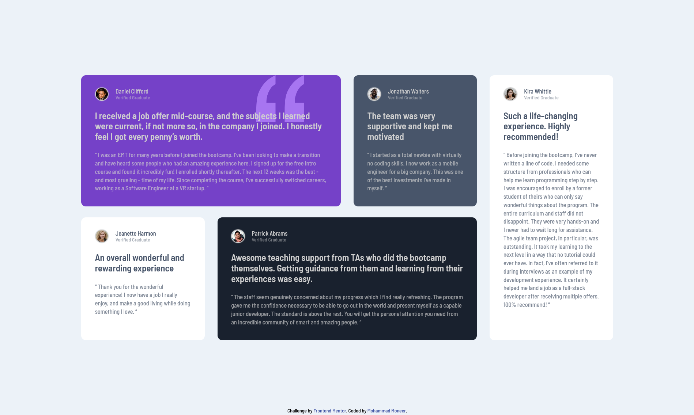

# Frontend Mentor - Testimonials grid section solution

This is a solution to the [Testimonials grid section challenge on Frontend Mentor](https://www.frontendmentor.io/challenges/testimonials-grid-section-Nnw6J7Un7). Frontend Mentor challenges help you improve your coding skills by building realistic projects.

## Table of contents

- [Overview](#overview)
  - [Screenshot](#screenshot)
  - [Links](#links)
- [My process](#my-process)
  - [Built with](#built-with)
  - [What I learned](#what-i-learned)
- [Author](#author)

## Overview
To get some details and background of this project visit the link below:
[Frontend Mentor | Testimonials grid section challenge](https://www.frontendmentor.io/challenges/testimonials-grid-section-Nnw6J7Un7)

### Screenshot

Desktop version

Mobile version

### Links

- [GitHub Repository](https://github.com/Mohammad-Moneer/testimonials-grid-section)
- [Live Demo](https://mohammad-moneer.github.io/testimonials-grid-section/)

## My process

### Built with

- HTML
- CSS
- Grid
- Flex

### What I learned

- Grid layout
- Adding background image and adjusting related properties

## Author

- Frontend Mentor - [@Mohammad-Moneer](https://www.frontendmentor.io/profile/Mohammad-Moneer)